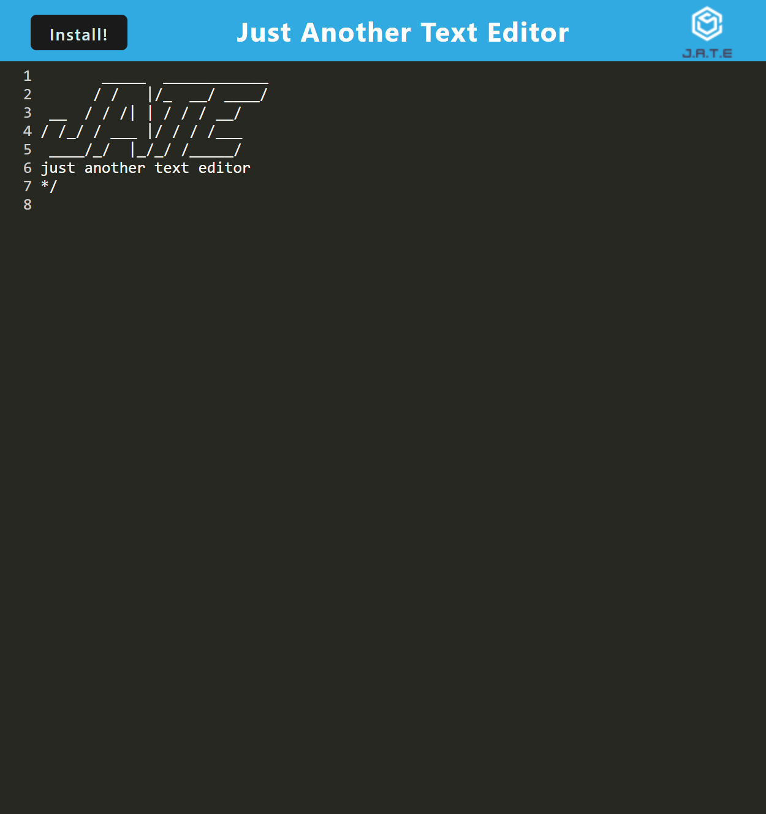

# PWA-editor

  ## Table of Contents:
  1. [Description](#description) 
  2. [Installation](#installation)
  3. [Usage](#usage)
  5. [Test Instructions](#testInstructions)
  6. [License](#license)
  7. [Questions](#questions)
  ## Description 

  A text editor that work on or offline and saves your work so you can come back to it later. The app uses PWA's which make it installable on to whatever device you would like to use.

  ## Installation 

  clone repo, open in editor, npm run start.

  ## Usage 

  
  deployed app: https://blooming-sierra-07568.herokuapp.com/

  ## Contribution Guidelines 

  feel free to contact me if you would like to contribute.

  ## Test Instructions 

  n/a

  ## license 

  MIT

  ## Questions 

  If you have any questions or want to get in touch you can contact me through email

  E-mail: lukerozon@gmail.com

  Github: https://www.github.com/zym0tic

